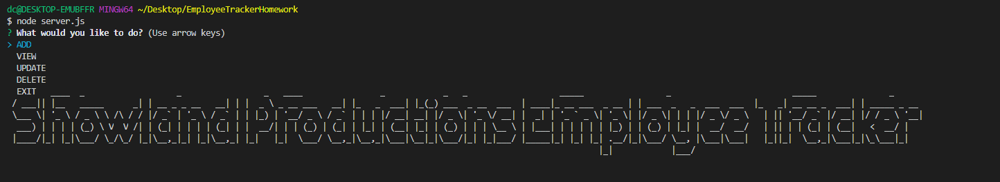
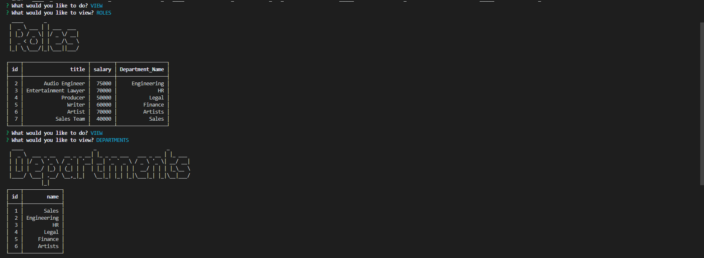
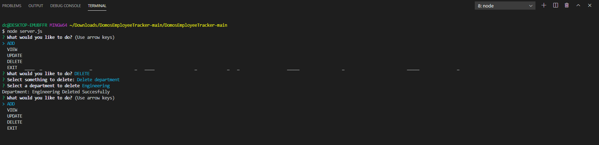

# Unit 12 MySQL Homework: Employee Tracker
## Description 
Developers are often tasked with creating interfaces that make it easy for non-developers to view and interact with information stored in databases. Often these interfaces are known as Content Management Systems. In this homework assignment, your challenge is to architect and build a solution for managing a company's employees using node, inquirer, and MySQL.
### App working example  
[Video Link App Working]()
### App Screen Shots

## Table of contents
- [Description](#Description)
- [App Working Example](#Description)
- [Installation](#Installation)
- [Usage](#Usage)
- [Repository Link](#Repository)
- [GitHub Info](#GitHub) 
## Installation
Run:
npm install
## Usage
Allows user to:
  * Add departments, roles, employees
  * View departments, roles, employees
  * Update employee roles
  * Update employee managers
  * Delete departments, roles, and employees
Run application by running:
node server.js
## Repository
- [Project Repo](https://github.com/ShowlandProductions/DomosEmployeeTracker)
## GitHub
- [GitHub Profile](https://github.com/ShowlandProductions)

